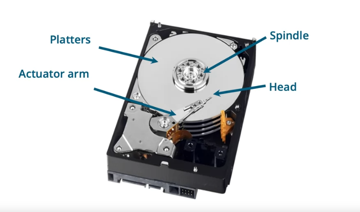
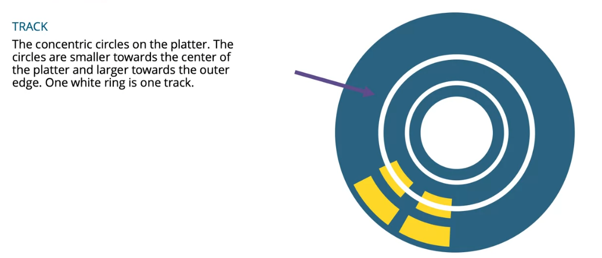
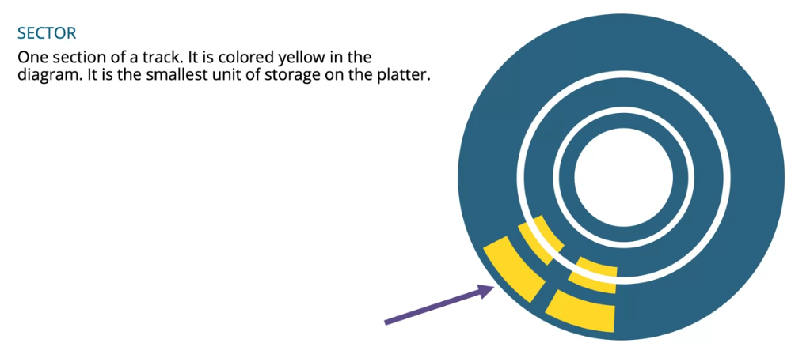
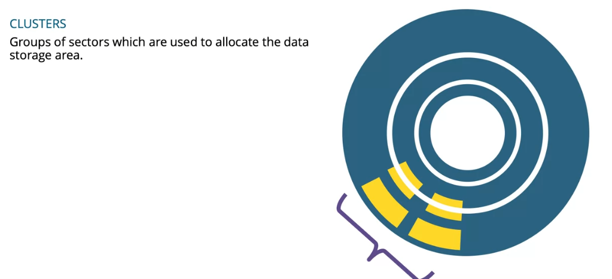
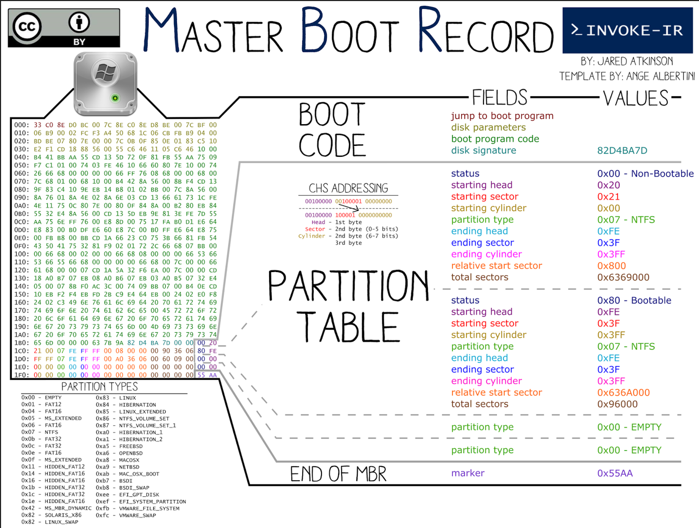

**A look at the master boot record and the GUID partition table. This module demonstrates the difference between the master boot record and the GUID partition table. This information gives the student an understanding of where to locate both partitions and data on the drive. The forensic student learns how to interpret the master boot record and locate the volume boot record for each volume on the drive.** 

# Learning Objectives

- The student will learn the difference between physical and logical drives
- The student will learn the difference between sectors and clusters.
- The student will learn about active disk editor.
- The student will learn about MBR partition schema.
- The student will learn about the GPT partition schema.
- The student will lean about solid state disks.

# Physical vs Logical Drives

## Physical Components of a Hard Disk

- Platters -- A hard disk

- Spindle -- Spins the Platters

- Heads -- Read/Write

- Actuator arm -- Aligns the heads

## Logical Disk Structures

- **`Low-level format`**
  
  - Physical lays down the tracks and sectors on the surfaces of the hard disk
  
  - Low-level formatting is performed by the manufacturer

- **`Logical parts of a disk`**

# Detail Sectors and Clusters

## Sectors

Segments of a track

- Address written into sector during low-level formatting

- Must have address before you can read a sector

- Sectors are relate to physical disk

A Sector is:

- Performed by manufacturer

- Usually 512 bytes size

- Smallest readable unit on disk

- Smallest writeable unit on disk

Sector Addressing 

- Sector numbering starts at 0

- Sector numbering can be physical or logical
  
  - Physical from start of disk 
  
  - Logical form start of volume

Logical Block Addressing (LBA)

- Each sector is numbered sequentially

- First sector is 0,1,2,3,... continuing until end of drive

- LBA X sectorSize(usually 512 bytes) = total bytes

Cylinders, heads, sectors (CHS)

- No longer used - Legacy addressing

- Related to physical structure of drive

- Limited to 8.2Gb

## Clusters

Groups of sectors:

- Clusters are written during high-level formatting 

- Cluster size can be set by user or OS

- Cluster size varies with the size of the disk

- Cluster numbering starts at 1

- Cluster are relative to the partition or volume

- Clusters are the smallest allocable unit

# MBR vs GPT

## Active Disk Editor Tools

Active@ Disk Editor - Freeware Hex Viewer & Hex Editor for raw sectors/clusters

[Download at here](https://www.disk-editor.org/index.html)

## MBR

`Readmore to understand`

- [What's at 1st sector/MBR of hard disk(MBR Forensics)](https://nixhacker.com/explaining-the-magic-of-mbr-and-its/)

- [read](./MBRandBoot.pdf)

## GPT

[PPT-Sumary](./Partition_Table_Documentation_Compressed.pdf)
